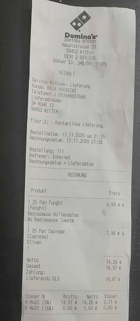

# tinvois-parser

An API to extract information from images of invoices/receipts. It extracts date, total amount,
amount excluding VAT and the merchant name.

## Why I made it?

We wanted to develop an app called tinvois to help freelancers in tax declaration. It is
available here: https://tinvois.de. We want to keep extra costs including 3rd party tools and marketing
really low to be able to keep the price of the app small.

One steps is to extract information from receipts photos. The open source solutions were not
good enough. There are commercial API's which either do not work or are too expensive or both.
So I developed it myself.

I can claim it is the best open source solution available.
Considering that Google charges only 1.5$ for OCRing each 1K images, it is almost free.
So let's make it really good.

## How it works

In the following steps

* Send the image to google Cloud Vision API to extract text
* Put the results in a pandas DataFrame (I am a data scientist, I love DataFrame :))
* Preprocess the results as follows
    - Join some words that we know come after each other and are meaningful together
    - In case the number, say, "12. 13" is detected as two words, join them
    - Tokenize the words in "SUM", "NETTO" (amount excluding VAT), "BRUTTO" (gross amount)
        "VAT", "VALUE" (words specifying a value) and "OTHER"
    - Convert the values to float and keep them in another DataFrame
    - Detect the rotation and rotate the coordinates back to vertical
    - For each value, extract a feature set. Namely tokens that appear in front of it,
      behind it, or on top of it.
* Extract information as follows
    - Date: get the date string via string matching. I just look for the first string I find.
    - Total amount and amount excluding vat: Writing rules using features extracted in the
        preprocessing step.
        Why not machine learning? Because I did not have data to train.
        So I had to play the role of ML algorithm based on my knowledge of receipts structure.
        The rules are set based on receipts common in Germany. Feel free to suggest rules for
        other countries

    - Merchant name: I listed a the most common merchants in Germany. It first tries to string
        match one from that list. If non of them found, it uses simply the first line in
        the image. Turns out it works fine :)

## Sample result

### Input image


### Result

    ```
    {
        "data": {
            "rotation": -4,
            "amount": 1497,
            "amountexvat": 1426,
            "merchant_name": "Domlno's",
            "date": "2020-11-17T00:00:00",
        }
    }
    ```

## How to use

You can start the API locally either via python or docker desktop.

### Common steps

* Get a Google Cloud Platform account
* Get access json file to Vision API. Rename it to google_auth.json

### Using python

* Put the google_auth.json in app/google_auth folder
* Install requirements
* Put an environmental variable called SERVER_TO_SERVER_TOKEN in your system containing a
  custom string. It will be the authorization token for calling the API
* In terminal navigate to app folder and run python .\manage-local.py
    
### Using docker (won't work in windows as mounting folder is not possible)

* Put the google_auth.json in a folder
* Run this commend
```
docker run --name tinvois-parser -d \
-p 5005:5001 \
-v <path to folder containing google_auth.json>:/app/google_auth \
-e SERVER_TO_SERVER_TOKEN=<some string will be used as authorization token> \
srhumir/tinvois-parser:latest
```
It will pull the image from docker hub and run it. The "latest" tag always corresponds to the
latest commit in master branch of this repository.

The API is accessible in localhost:5001. Enter it in your browser to see the swagger UI

## What else it can do
* I added also endpoints for detecting edges of paper in the image and also making a bird
    view of the document using the edges.

## Acknowledgements
* The first ideas of the parsing came from here
    https://github.com/ReceiptManager/receipt-parser-legacy
* I got the tokenizing idea from here
    https://medium.com/@Fivestars/receipt-parsing-via-machine-learning-1a3c495394d9
* The document edge detection and bird eye view is highly dependent on
    https://www.pyimagesearch.com/2014/09/01/build-kick-ass-mobile-document-scanner-just-5-minutes/
* Last but not least. I used these two tutorials to learn how to develop a proper Flask rest-API
    - https://preslav.me/2018/12/02/designing-well-structured-rest-apis-with-flask-restplus-part-1/
    - https://www.freecodecamp.org/news/structuring-a-flask-restplus-web-service-for-production-builds-c2ec676de563/

## TODO's

* Prepare a runnable windows powershel docker command
* Make it to be able to use Azure OCR API
* Improve how it gets the google json file so mounting a folder in the docker command is not
    necessary
* Do proper image hashing.
* Extract merchant address.
* Produce data for training ML algorithm
